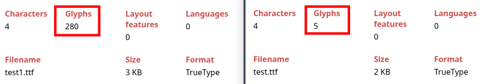

<!--- TODO: finish subsetting section --->
<!--- subsetted font file suffix --->
<!--- TODO: add diagrams in implementation section --->

---

## Introduction

Recently, me and my friend [Shivang](https://github.com/shivkr6/) got selected for KDE's mentorship programme, 
[Season of KDE](https://mentorship.kde.org/sok/) 2026.

> https://mentorship.kde.org/blog/2026-01-21-sok-26-welcome/#implement-font-subsetting-when-saving-files-in-okular

Our proposal included implementing font subsetting in their PDF reader, [Okular](https://okular.kde.org/).

### A Brief Overview of Fonts

Font files are of many extensions; the most common ones include TrueType *(.ttf)* and OpenType *(.otf)* which are binary files containing
data organized in specific tables.

Both of which are really similar (they both share the same structure involving tables for storing certain types of data). They primarily
differ in the fact that TrueType uses quadratic [Bézier curves](https://en.wikipedia.org/wiki/B%C3%A9zier_curve) while OpenType uses 
cubic ones.

Also, TrueType was developed by Apple in the late 80s and OpenType was developed by Microsoft and Adobe. It was derived from the original
TrueType format and is able to contain both TrueType and PostScript data.

This [awesome YouTube video](https://youtu.be/BfEvIjTQkIE?si=GSV6CbWuBMePFYnc) covers the history of fonts really well, starting from bitmaps
and going all the way upto vector fonts. Also, [Sebastian Lague's video on fonts](https://www.youtube.com/watch?v=SO83KQuuZvg) helped a lot
to understand the format of TTF files. I highly suggest giving it a watch!

Here are some of the important tables in TTF/OTF formats relevant to font subsetting:

| Name       	| Purpose                                                                            	|
|------------	|------------------------------------------------------------------------------------	|
| `glyf`     	| Stores visual outlines of the characters.                                          	|
| `loca`     	| Contains the addresses to the relevant glyphs from the `glyf` table.               	|
| `cmap`     	| Maps unicode value (like `U+0042` for 'B') to a glyph ID.                          	|
| `hmtx`     	| Stores the width of the character and the amount of whitespace to the left of it.  	|
| `head`     	| Global font header (contains info about the font's version etc.) and its checksum. 	|

One thing to note is that in TTF files there are simple glyphs (like `a`) and composite glyphs (like `é`) formed by combining multiple 
simple glyphs.

Side note: `hmtx` is different from kerning (which uses the `kern` table) because `hmtx` defines how much width the character actually takes up
and the left side bearing (initial space) while kerning defines how much space there is between *two* characters. Kerning takes priority
when specific characters are grouped together to make it look more natural (like "AV" or "To").


Anyhow, we are getting a bit sidetracked as most of the actual font (and by extension, subsetting) logic is abstracted away by the use
of the [HarfBuzz](https://harfbuzz.github.io/) API.

### What *is* Font Subsetting?

Font subsetting includes stripping away unused characters from a bigger, original font file and essentially creating a subset of *only* the 
characters needed.

For example, a `JetBrainsMono-Regular.ttf` downloaded from their website is almost `114 kb`. A trimmed down version of this font file
subsetted for the string "hello" (so it only contains `h`, `e`, `l` and `o`) is around `1.7 kb`.

How is this relevant to a PDF reader?

When new text annotations are added in Okular, the whole font file is embedded into the PDF which makes the PDF file size huge (especially for
fonts that contain a lot of glyphs). Font subsetting completely mitigates this issue by reducing the size of the embedded font file.

While the proposal implies font subsetting in Okular, most of the work is to be done in [Poppler](https://poppler.freedesktop.org/), the
PDF backend and rendering engine which Okular uses.

## Example Subsetting Function (using HarfBuzz)

After a lot of planning, we decided to use the `hb` and [hb-subset](https://harfbuzz.github.io/harfbuzz-hb-subset.html) APIs provided by HarfBuzz.

Here's an example function `subset_font()` which takes in an *input* file path, an *output* file path and the text to generate the subsetted font
file.

```cpp
#include <hb-subset.h>
#include <hb.h> // for hb_font_t and hb_shape

void subset_font(const char *in, const char *out, const std::string &text) {
  // map the font file on disk into a HarfBuzz blob on memory
  hb_blob_t *blob = hb_blob_create_from_file(in);
  // new face object from the blob
  hb_face_t *face = hb_face_create(blob, 0);
  // new font object from specified face
  hb_font_t *font = hb_font_create(face);
  // new subset input object (fails if hb-subset is missing)
  hb_subset_input_t *input = hb_subset_input_create_or_fail();
  // hold the input text and its properties before shaping
  hb_buffer_t *buf = hb_buffer_create();

  // retain GID mappings
  hb_subset_input_set_flags(input, HB_SUBSET_FLAGS_RETAIN_GIDS);

  // shape text directly to GIDs
  hb_buffer_add_utf8(buf, text.c_str(), -1, 0, -1);
  hb_buffer_guess_segment_properties(buf);
  hb_shape(font, buf, nullptr, 0);

  // add GIDs to the subset input
  unsigned int count;
  hb_glyph_info_t *info = hb_buffer_get_glyph_infos(buf, &count);
  for (unsigned int i = 0; i < count; i++) 
    hb_set_add(hb_subset_input_glyph_set(input), info[i].codepoint);

  // generate a subsetted font file and save on disk
  if (hb_face_t *s_face = hb_subset_or_fail(face, input)) {
    hb_blob_t *res = hb_face_reference_blob(s_face);
    unsigned int len;
    const char *data = hb_blob_get_data(res, &len);
    
    if (FILE *f = fopen(out, "wb")) {
      fwrite(data, 1, len, f);
      fclose(f);
    }
    hb_blob_destroy(res);
    hb_face_destroy(s_face);
  }

  // cleanup
  hb_buffer_destroy(buf);
  hb_font_destroy(font);
  hb_subset_input_destroy(input);
  hb_face_destroy(face);
  hb_blob_destroy(blob);
}
```

### Explaining the HarfBuzz types

- #### `hb_blob_t`:

From the [HarfBuzz manual](https://harfbuzz.github.io/harfbuzz-hb-blob.html#hb-blob-t):

> Data type for blobs. A blob wraps a chunk of binary data and facilitates its lifecycle management between a client program and HarfBuzz.

A blob is a wrapper for raw binary data (in this case, the font file). This abstracts away the memory management aspect of loading the data,
as in, parts of the font file can be lazy loaded as required. 

- #### `hb_face_t`:

From the [HarfBuzz manual](https://harfbuzz.github.io/harfbuzz-hb-face.html):

> A font face can be created from a binary blob using `hb_face_create()`. The face index is used to select a face from a binary blob 
that contains multiple faces. For example, a binary blob that contains both a regular and a bold face can be used to create two font 
faces, one for each face index.

```cpp
hb_face_t *face = hb_face_create(blob, 0);
```

Here, the blob is passed as the first argument and the second argument is the `faceIndex`. Since we're only dealing with **.ttf** files here,
we can safely pass the face index as 0. However this would differ for font collections (**.ttc** files).

```
Single Font File (.ttf):            Font Collection (.ttc):

 _______________________             ________________________
|                       |           |                        |
|      faceIndex=0      |           |  faceIndex=0: Regular  |
|      (only one)       |           |  faceIndex=1: Bold     |
|_______________________|           |  faceIndex=2: Italic   |
                                    |________________________|

```

- #### `hb_font_t`:

From the [HarfBuzz manual](https://harfbuzz.github.io/harfbuzz-hb-font.html#hb-font-t):

> Data type for holding fonts.

An `hb_font_t` is essentially an `hb_face_t` with added instance parameters like scale, [PPEM (pixels per EM)](https://learn.microsoft.com/en-us/typography/opentype/spec/ttch01#display-device-characteristics), 
PTEM (points per EM) and variations (eg: Weight=700, Width=120 etc.).

- #### `hb_subset_input_t`:

From the [HarfBuzz manual](https://harfbuzz.github.io/harfbuzz-hb-subset.html#hb-subset-input-t):

> Things that change based on the input. Characters to keep, etc.

- #### `hb_buffer_t`:

From the [HarfBuzz manual](https://harfbuzz.github.io/harfbuzz-hb-buffer.html#hb-buffer-t):

> The main structure holding the input text and its properties before shaping, and output glyphs and their information after shaping.

This object eventually contains the string of unicode characters from the inputted text (which then gets used to generate the subsetted font).
After shaping, (`hb_shape()`), the buffer holds the glyph IDs and other glyph data.

### Retaining GID mappings

HarfBuzz provides a flag which can be set to avoid remapping the glyph IDs of the characters in the subsetted file.

```cpp
hb_subset_input_set_flags(input, HB_SUBSET_FLAGS_RETAIN_GIDS);
```

From the [HarfBuzz manual](https://harfbuzz.github.io/harfbuzz-hb-subset.html#hb-subset-input-set-flags):

|  |  |
|---|---|
| `HB_SUBSET_FLAGS_RETAIN_GIDS` | If set glyph indices will not be modified in the produced subset. If glyphs are dropped their indices will be retained as an empty glyph. |


Remember the `cmap` table from earlier? Because the GIDs (glyph IDs) have changed, it must be rebuilt so that the unicode codepoints
point to new, lower indices.

Passing this flag enables us to retain the original GIDs. Poppler's code internally requires the GIDs to *not* be remapped (more on this
later).
However, there is a caveat to this.

Here's an example:

Below is a comparison of two different subsetted TTF files from a `JetBrainsMono-Regular` TTF file, with the retain GID mappings flag enabled for `test1.ttf`
and disabled for `test.ttf`, for the string "hello".

Notice the difference in the number of glyphs:


However, both of them contain the exact same number of characters:


This is because when retaining the GID mappings, HarfBuzz "pads" the file with a bunch of empty glyphs.
Hence the output font file size is comparatively bigger.

## Configuring the development environment

### Setting up `kde-builder`

After looking into the process of developing KDE applications, we found out that KDE provides their own build automation tool called
`kdesrc-build`.

However, this ended up being a dead end as after finishing all the setup, we found out about `kde-builder` (the official successor and 
reimplementation of `kdesrc-build`).

After setting up the tool, we also configured Okular and Poppler to use custom source directories:

In `~/.config/kde-builder.yaml`:

```yaml
project poppler:
  repository: ""
  no-src: true
  source-dir: "<path to src dir>"
  cmake-options: >
    -DCMAKE_BUILD_TYPE=RelWithDebInfo
    -DBUILD_GTK_TESTS=OFF
    -DBUILD_QT5_TESTS=OFF
    -DBUILD_QT6_TESTS=OFF
    -DBUILD_CPP_TESTS=OFF
    -DENABLE_UTILS=OFF
    -DENABLE_CPP=OFF
    -DENABLE_GLIB=OFF
    -DENABLE_QT5=OFF
    -DENABLE_QT6=ON

override okular:
  no-src: true
  source-dir: "<path to src dir>"
```

Both of us faced an issue with the documentation checker when we were trying to compile Wayland. This got fixed with:

```yaml
override wayland:
  meson-options: "-Ddocumentation=false"
```
--- 

```bash
kde-builder poppler # building poppler for the first time
kde-builder okular # building okular for the first time

kde-builder --run okular # running okular

kde-builder poppler --no-include-dependencies # subsequent poppler builds
kde-builder okular --no-include-dependencies # subsequent okular builds
```

### Setting up `gdb`

Shivang ended up configuring [GDB (GNU Debugger)](https://en.wikipedia.org/wiki/GNU_Debugger) to be used with Okular and Poppler for better debugging.

The following steps were taken:

**1.** Changing the `cmake-options` in `kde-builder.yaml` from
`DCMAKE_BUILD_TYPE=RelWithDebInfo` to `DCMAKE_BUILD_TYPE=Debug`.

**2.** Forcing a rebuild of Poppler:
```bash
kde-builder poppler --refresh-build --no-include-dependencies
```

**3.** `source ~/kde/build/prefix.sh` for loading all the required environment variables.

**4.** Running `gdb okular`.

### Linking the HarfBuzz library in Poppler

Since Poppler uses `CMake` as its build system, I edited `CMakeLists.txt` to include HarfBuzz as a dependency to enable the use of header
files like `hb.h` and `hb-subset.h`.

```cmake
pkg_check_modules(HARFBUZZ REQUIRED harfbuzz>=2.0.0 harfbuzz-subset)
```

```cmake
set(poppler_LIBS 
    Freetype::Freetype 
    ZLIB::ZLIB 
    ${HARFBUZZ_LIBRARIES}
)
```

```cmake
target_include_directories(poppler SYSTEM PRIVATE ${HARFBUZZ_INCLUDE_DIRS})
```

## Poppler Integration

### Relevant Commits

Shivang ended up finding the relevant commits related to font embedding in the commit history:

- [Annotations: Make sure we embed fonts for the FreeText annots](https://gitlab.freedesktop.org/poppler/poppler/-/commit/5f915d46c99ecbc0c026b86de50f9e0243391a01)

- [Signatures: Make sure we embed the needed fonts](https://gitlab.freedesktop.org/poppler/poppler/-/commit/db7865c6a38dd9d26d8b16ab2727fcec311efad8)

- [Forms: Make sure we embedd fonts as needed](https://gitlab.freedesktop.org/poppler/poppler/-/commit/0b474ffb990a8285a6d3c2bf157b32b2264fb140)

Poppler also contains support for stream compression (to compress font streams in forms), added in [this](https://gitlab.freedesktop.org/poppler/poppler/-/commit/7d87c7d2c6ca4f814f87329534a17dbf30203313)
commit.

### Relevant Functions

We narrowed down the relevant functions as follows:

#### In `poppler/GlobalParams.cc`: 

- `findSystemFontFileForChar()` searches the computer for a font which contains a specific glyph for a character.
- `findSystemFontFileForFamilyAndStyle()` finds a font on the computer based on the requested font family and style.
- `supportedFontForEmbedding()` checks if the found font type is TrueType (.ttf), TrueType Collection (.ttc), or OpenType (.otf) since
those are the only font file types supported by Poppler.

#### In `poppler/Form.cc`: 
- `addFontToDefaultResources()` takes the font file as a parameter and embeds it into the PDF's resources.
- `ensureFontsForAllCharacters()` checks whether all the relevant characters in the PDF can be displayed by the current font. If not, it starts
the font embedding process once again.
- `findFontInDefaultResources()` searches for a specific font within a PDF form's default resource dictionary and returns its internal
resource name (key) if found.

*Side note: The default resource dictionary (denoted as `/DR`) holds the technical definitions for everything the PDF viewer needs to
display form data consistently.*

#### In `poppler/Annot.cc`:

- The type `AnnotText` handles all the sticky notes. However this is not relevant to us as the system handles the font here.
- `AnnotFreeText` handles text typed directly on the page. It includes complex text layouting (`layoutText()`) to wrap lines and also
includes the ability to choose fonts.

So for all `AnnotFreeText` objects, we need to intercept the font stream before it gets embedded into the PDF and then subset it.

### Subsetting the font data in `addFontToDefaultResources()`

[ WIP ]

### Current Implementation (Font Embedding Into Global Resource)

When the user creates an annotation, selects a font (eg. Arial) and clicks apply, Poppler does two things:
- It checks the PDF's global `/Resources` dictionary.
- If the font is not there, it takes the font data and writes it to the global resource.

Poppler then uses the font stored in the global resource to render the characters on the screen.

The appended font is not subsetted. If it were, when the user adds the next annotation, and if the annotation contains characters that are
not in the appended font file, then the text would fail to render.

### Proposed Implementation (Subsetted Font Embedding Into Annotation's Local Resource)

Here, we modify the process to append the subsetted font file to the annotation's local resource instead of the PDF's global resource.

We aim to make it such that the process happens in four steps:

1. When the user selects the font and clicks apply, the entire font file gets appended into the annotation's local resource.
2. As the user adds or delete characters, the full font file gets used to prevent any missing glyphs.
3. When the user saves the PDF, we scan the annotation's text and pass it into the subsetting function which outputs the embedded font file
subsetted for that specific string.
4. The original font file is deleted from the annotation's local resource and replaced with the subsetted font file.

## References

[ Will add once draft is complete ]
